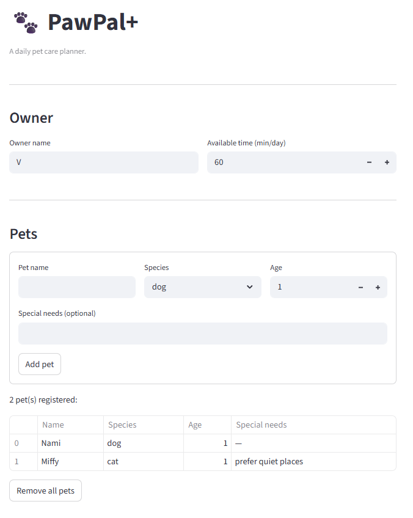
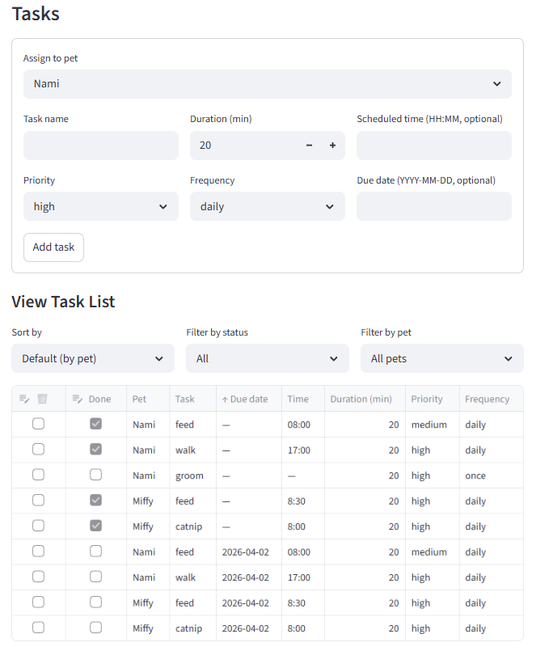
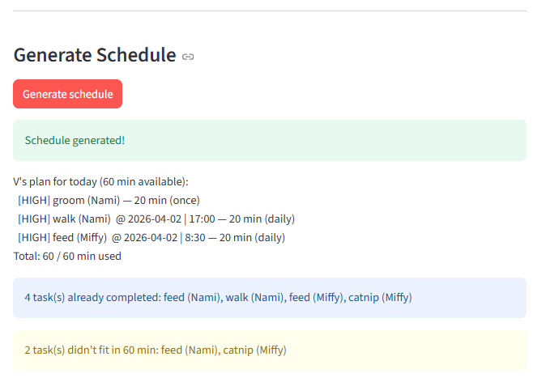

# PawPal+ (Module 2 Project)

You are building **PawPal+**, a Streamlit app that helps a pet owner plan care tasks for their pet.

## Scenario

A busy pet owner needs help staying consistent with pet care. They want an assistant that can:

- Track pet care tasks (walks, feeding, meds, enrichment, grooming, etc.)
- Consider constraints (time available, priority, owner preferences)
- Produce a daily plan and explain why it chose that plan

Your job is to design the system first (UML), then implement the logic in Python, then connect it to the Streamlit UI.

## What you will build

Your final app should:

- Let a user enter basic owner + pet info
- Let a user add/edit tasks (duration + priority at minimum)
- Generate a daily schedule/plan based on constraints and priorities
- Display the plan clearly (and ideally explain the reasoning)
- Include tests for the most important scheduling behaviors

## Getting started

### Setup

```bash
python -m venv .venv
source .venv/bin/activate  # Windows: .venv\Scripts\activate
pip install -r requirements.txt
```

### Suggested workflow

1. Read the scenario carefully and identify requirements and edge cases.
2. Draft a UML diagram (classes, attributes, methods, relationships).
3. Convert UML into Python class stubs (no logic yet).
4. Implement scheduling logic in small increments.
5. Add tests to verify key behaviors.
6. Connect your logic to the Streamlit UI in `app.py`.
7. Refine UML so it matches what you actually built.

## Smarter Scheduling

**Sorting & Filtering**
- `Task` gained a `time: str` field for scheduled start time in `"HH:MM"` format
- `Scheduler.sort_tasks_by_time()` — sorts all tasks using a lambda key; tasks without a time sink to the bottom
- `Scheduler.filter_tasks(completed, pet_name)` — filter by completion status and/or pet name; both parameters are optional
- UI: "View Task List" section with Sort by, Filter by status, and Filter by pet dropdowns

---

**Recurring Tasks**
- `"as_needed"` frequency renamed to `"once"`
- `Task` gained a `due_date: str` field (`"YYYY-MM-DD"`)
- `Task.next_occurrence()` — returns a new `Task` for the next recurrence using `timedelta` (daily = +1 day, weekly = +7 days, once = None)
- `Scheduler.handle_completion(pet, task)` — marks a task done and automatically adds the next occurrence to the pet's task list
- UI: due date input in the task form; checking "Done" in the table calls `handle_completion`

---

**Task Deletion**
- `Pet.remove_task()` method added
- UI: 🗑️ checkbox column in the task table — checking it immediately removes the task

---

**Conflict Detection**
- `Scheduler.get_conflicts()` — groups pending tasks by time slot and returns any slot with 2+ tasks
- `Scheduler.generate_plan()` updated with a `booked_slots` set — only the highest-priority task per time slot makes it into the plan; conflicting tasks are skipped
- `Scheduler.get_summary()` refactored to delegate to `generate_plan()` so both are always in sync
- Schedule output now prints the date and time of each task (`@ 2026-04-01 | 08:00`)
- UI: conflict warnings are shown separately from "didn't fit" warnings, explaining which task won and which was omitted

## "Testing PawPal+"
**Command to run tests:**
```bash
python -m pytest tests/test_pawpal.py -v
```

`test_mark_complete_changes_status`: `Task.mark_complete()` flips completed from False to True
`test_add_task_increases_pet_task_count`: `Pet.add_task() correctly appends to the pet's task list
`test_sort_tasks_by_time_returns_chronological_order`: `Scheduler.sort_tasks_by_time()` returns tasks in earliest-to-latest order, with tasks that have no time set placed last
`test_daily_task_creates_next_day_recurrence`: `Scheduler.handle_completion()` marks the task done and automatically creates a new task with a due date of today + 1 day
`test_conflict_detection_flags_duplicate_times`: `Scheduler.get_conflicts()` correctly identifies two tasks sharing the same time slot and groups them under that slot key

## Features

### Task Management
- **Add tasks** to any pet with a name, duration, priority, frequency, optional scheduled time (`HH:MM`), and optional due date (`YYYY-MM-DD`)
- **Delete tasks** via the 🗑️ checkbox column in the task table — removed immediately
- **Mark tasks complete** via the Done checkbox — completed tasks are excluded from future scheduling
- **Reset tasks** back to incomplete if needed

### Multi-Pet Support
- An owner can register any number of pets, each with a name, species, age, and optional special needs
- Each pet maintains its own independent task list
- All scheduling, sorting, filtering, and conflict detection work across all pets simultaneously

### Priority-Based Scheduling
- `Scheduler.generate_plan()` sorts all pending tasks by priority (`high → medium → low`) using a numeric lookup table before building the plan
- Tasks are added greedily in priority order until `Owner.available_time` (minutes/day) is exhausted
- Lower-priority tasks are never scheduled ahead of higher-priority ones, even if they would fit in remaining time

### Time Conflict Detection
- `Scheduler.get_conflicts()` groups pending tasks by their `HH:MM` time slot and flags any slot with 2 or more tasks
- During plan generation, a `booked_slots` set ensures only the highest-priority task per time slot enters the schedule — conflicting tasks are skipped entirely
- The UI shows a dedicated warning per conflicted slot identifying the winning task and the omitted ones, separate from the "didn't fit in time" warning

### Automatic Recurrence
- `Task.next_occurrence()` uses Python's `timedelta` to compute the next due date: today + 1 day for `daily`, today + 7 days for `weekly`
- `Scheduler.handle_completion()` marks the task done and automatically appends the next occurrence to the pet's task list
- Tasks with frequency `once` return `None` from `next_occurrence()` and are never rescheduled

### Sorting
- `Scheduler.sort_tasks_by_time()` returns all tasks across all pets in chronological order using a lambda key on the `time` field
- Tasks with no scheduled time are placed last using the sentinel value `"99:99"`

### Filtering
- `Scheduler.filter_tasks()` accepts two optional parameters: `completed` (bool) and `pet_name` (str)
- Either or both can be provided — omitting a parameter skips that filter
- Enables views like "all pending tasks for Buddy" or "all completed tasks across all pets"

### Schedule Summary
- `Scheduler.get_summary()` delegates entirely to `generate_plan()` so the printed output is always in sync with the actual plan
- Each line shows priority, task name, pet name, scheduled date and time (if set), duration, and frequency
- Prints a total time used vs. available at the bottom
- Returns a contextual message when no tasks are scheduled: distinguishes between "all tasks already completed" and "nothing fit in the time budget"

### Task Aggregation
- `Owner.get_all_tasks()` and `Owner.get_all_pending_tasks()` flatten task lists across all pets into a single list, used internally by the Scheduler

## 📸 Demo

<a href="demo/demo1.png" target="_blank"></a>
<a href="demo/demo2.png" target="_blank"></a>
<a href="demo/demo3.png" target="_blank"></a>


